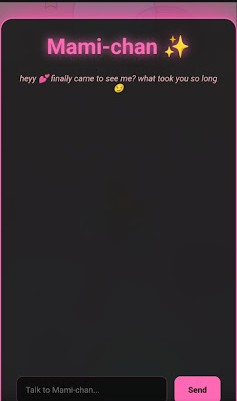
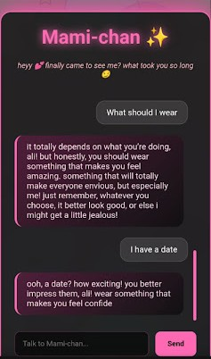

# 💬 Mami-chan AI — My First Full-Stack Project

A personality-driven AI chatbot that combines a "Cyber-Anime" aesthetic with real-world API handling. Mami-chan is a playful, flirty AI assistant built to simulate engaging conversation while maintaining reliability even when external APIs fail.

Built in 48 hours 🚀

---

## 📱 Mobile Preview
Mami-chan is fully responsive and optimized for mobile chatting!

<p align="center">
  
  
</p>

---

## 🧠 What It Does
- **Custom Personality:** A flirty, engaging AI chatbot with a unique conversational style.
- **Context Awareness:** Remembers basic user info (like your name) during the session.
- **Reliability:** Built-in fallback system to handle OpenAI API failures or quota issues (429 errors) so the chat never breaks.

## ✨ Features
- 🎭 **Custom AI Personality:** Not just a standard bot; she has "attitude."
- 🧠 **Memory Handling:** Uses local sessions to track user names.
- 🔁 **Memory Reset:** Features a "Clear Memory" button to reset the conversation.
- 📱 **Mobile-First Design:** Tested and optimized for both Desktop and Mobile browsers.
- ⚡ **OpenAI Integration:** Powered by `gpt-4o-mini` for fast, smart responses.

## 🛠️ Tech Stack
- **Frontend:** HTML5, CSS3 (Custom animations), Vanilla JavaScript
- **Backend:** Node.js, Express
- **API:** OpenAI API
- **Tools:** Git, GitHub, ProtonVPN (Network Testing)

---

## 🚀 Installation & Local Demo

1. **Clone the repo:**
   ```bash
   git clone [https://github.com/s2kvroom/ai-chat-app.git](https://github.com/s2kvroom/ai-chat-app.git)
   cd ai-chat-app
---

## 🚀 How to Run Locally

1. Clone the repo:
```bash
git clone https://github.com/s2kvroom/ai-chat-app.git
cd ai-chat-app
